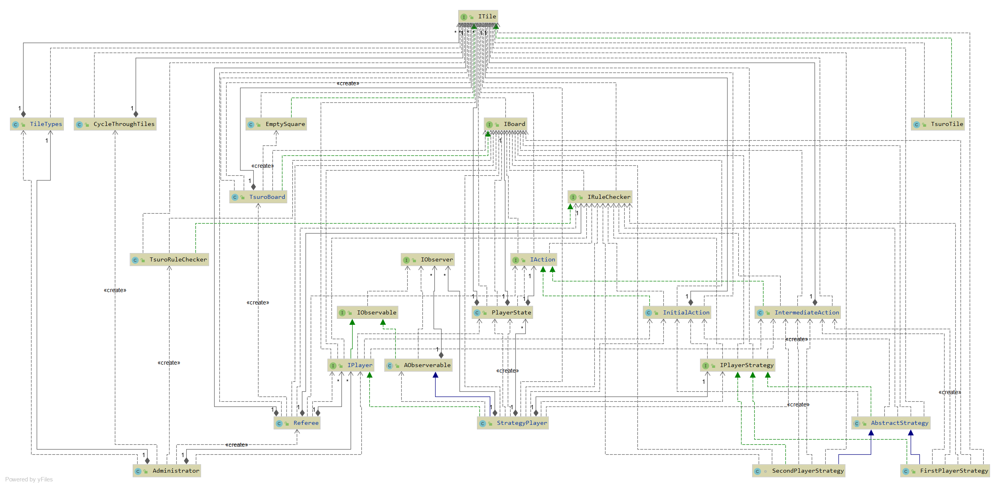

# We are Implementing a Game of Tsuro

The specifications and rules for the game of Tsuro can be found [here](https://ccs.neu.edu/home/matthias/4500-f19/tsuro.html). 

# Components

A tournament of Tsuro starts with the `Administrator`. They're in charge of running the overall tournament for
the `Player`s that register. Games of Tsuro are played by `Referee`s, which the `Administrator` creates. The `Referee`
asks `Player`s to make `IAction`s, giving the player `ITile`s to place. The `Referee` will check the `IAction`s using an
 `IRuleChecker`, and perform them on an `IBoard`. `Observer`s are available for components that implement `IObservable`.   

# Folders
```
 _    _  ___  ______ _   _ _____ _   _ _____ 
| |  | |/ _ \ | ___ \ \ | |_   _| \ | |  __ \
| |  | / /_\ \| |_/ /  \| | | | |  \| | |  \/
| |/\| |  _  ||    /| . ` | | | | . ` | | __ 
\  /\  / | | || |\ \| |\  |_| |_| |\  | |_\ \
 \/  \/\_| |_/\_| \_\_| \_/\___/\_| \_/\____/
                                          

```
                                                    
 - The Observer from `observer-interface.java` has been moved to Common/src/com/tsuro/observer/IObserver.java
 - The Observer from `player-observer.java` has been moved to Common/src/com/tsuro/observer/robserver/PlayerObserver.java
 - The Player Interface from `player-interface.java` has been moved to Common/src/com/tsuro/player/IPlayer.java
 - The Strategy from `first-s.java` has been moved to Common/src/com/tsuro/strategy/FirstPlayerStrategy.java
 - The Player from `player.java` has been moved to Common/src/com/tsuro/player/StrategyPlayer.java
 - The referee from `referee.java` has been moved to Common/src/com/tsuro/referee/Referee.java
 
 There is a UML available here 
 
 ### Dynamic Dependencies
 - The Administrator and Referee receive and use `StrategyPlayer`s.
 - The StrategyPlayer receives either `FirstPlayerStrategy` or `SecondPlayerStrategy`
 - The Administrator, Referee, and Player use `TsuroBoard`
 - The Administrator, Referee, and Player use `TsuroTile`s
 - The Board uses both subclasses of `ITile` (which are `TsuroTile` and `EmptySquare`)
 - The Referee receives a `CycleThroughTiles` that the Administrator creates
 - The Referee, Player, and Actions all use `TsuroRuleChecker`
 - The Referee uses `InitialAction`s and `IntermediateAction`s that the player creates

 ### Planning
  - Planning contains all of the documents describing how we
  designed our implementation of Tsuro. Each .md file describes a different initial specification of components.
  - UML.png contains the UML seen above. 

### Common
  - Common contains shared code for our implementation. 

  - metainfs/ contains metadata for building JARs. It can be ignored

  - junit-platform-console-standalone-1.5.2/jar is a Java executable from JUnit that runs JUnit tests in the command line. See the test section for more details.

  - test/ contains all of the Unit Tests for the TsuroBoard implementation. Package structure mimics src/'s

  - lib/ contains external libraries used in our implementation. It can be ignored when browsing source code

  - out/ contains the artifacts created from building our game into Java executables. There should be an easier way to always run programs from the top-level directory, so out/ can be ignored.

##### src
  src/ contains most of the source code for Tsuro

  - Within src/com/tsuro are the separate packages for a game of Tsuro
    - action/ contains the implementation for actions that can be taken on the board 
      - actionpat/ contains JSON deserializers for action-pats
    - board/ contains the implementation of the board
      - statepat/ contains JSON deserializers to construct a board from JSON
    - observer/ contains the interface for observers
      - observer/robserver contains a test harness for observers
    - tile/ contains the implementation of tiles and classes for interacting with them
      - /tile/tiletypes contains files for processing JSON  representation of Tiles, and querying them
      - /tile/tiletypes/tsuro-tiles-index.json contains all of the indices that we will be referring to Tiles by, as well as their connections
    - rulechecker/ contains the implementations for a rules component
      - xrules/ contains a test harness for rulecheckers
    - action/ contains the implementations for an action component
    - player/ contains the classes for players to use
    - referee/ contains a strategy for referees to use when choosing tiles
    - strategy/ contains the interface for players to use when creating strategies for themselves
    - utils/ contains utility classes for different parts of Tsuro to use

  ### Admin
  Admin/ contains code for an administrator
  
  ### Player
  Player/ contains code for a strategy of players that attempts to choose legal tiles.
  
  ### .idea
  - .idea includes some defaults for the editor we chose to use, IntelliJ. Feel free
  to ignore it.
  
  

# Project progress

  - Analyzing tiles to find all 35 possible rotations. Code can be found at Common/src/com/tsuro/tile/Tiles.java
  - An implementation for a Board of a game of Tsuro is now done. Code can be found at Common/src/com/tsuro/board
  - Rulecheckers have been implemented, check them out at Common/src/com/tsuro/rules
  - Observers for players have been implemented, check them out Common/src/com/tsuro/observer
  - 10/22/19, Referees and Players have been implemented. Referees can be found at Common/src/com/tsuro/referee. Players can be found at Common/src/com/tsuro/player.
  - 10/27/19, Administrators have been implemented, can be found at Admin/

## Tests

  - To run all tests, do ./xtest in the Tsuro Directory. This will run all JUnit
    tests
    
    
# Notes on Libraries
  - For JSON Parsing, we use [GSON](https://sites.google.com/site/gson/gson-user-guide)
  - For shortening boilerplate, we use [Lombok](https://projectlombok.org)
  - To extend Java, we use [Guava](https://opensource.google/projects/guava)